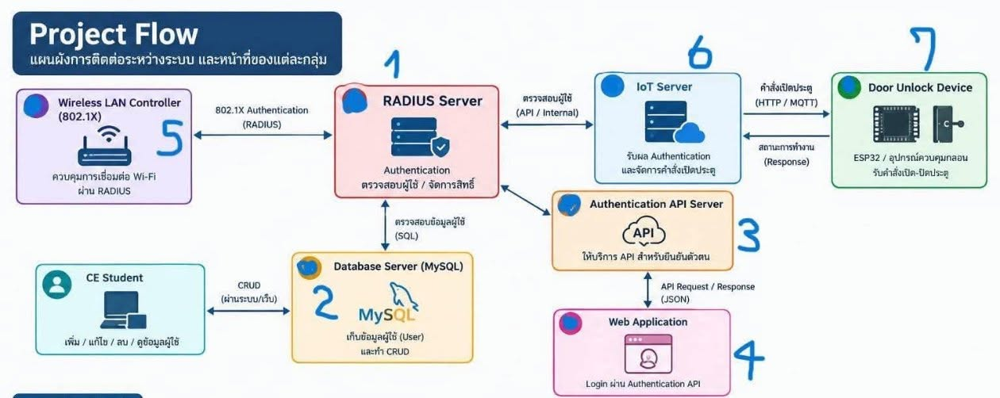

# Database Admin (Group 2) - CE Central User Database Portal

ระบบบริหารจัดการฐานข้อมูลผู้ใช้กลาง (Central User Database) สำหรับโครงการควบคุมการเข้า-ออกและยืนยันตัวตนผ่าน Wi-Fi 802.1X (FreeRADIUS) และระบบประตูดิจิทัล (IoT Door Access)



## 📌 สถาปัตยกรรมระบบ (System Architecture)
- **Database Server:** PostgreSQL 17 on Debian 13 VM (Host `Database-Server` / IP `192.168.100.102:5432`)
- **Admin & Student Web Portal:** Next.js 16 (App Router) + TypeScript + Tailwind CSS
- **Authentication Integration:**
  - **Group 1 (RADIUS Server):** Query ตรวจสอบผู้ใช้ผ่าน SQL View `radcheck`
  - **Group 3 (Authentication API):** Query ข้อมูลผู้ใช้จากตาราง `users` เพื่อให้บริการ API
- **Documentation & Progress:** ดูบันทึกการทำงานและสถานะระบบแบบละเอียดได้ที่ [PROJECT_PROGRESS.md](PROJECT_PROGRESS.md)

---

## 🖥️ ข้อมูลการเชื่อมต่อเซิร์ฟเวอร์เสมือน (VM Specs)
* **IP วงในระหว่าง VM:** `192.168.100.102`
* **พอร์ต Database:** `5432` (PostgreSQL)
* **Database Name:** `cedatabase`
* **Database User:** `ceadmin`
* **SSH Access ภายนอก (ผ่าน Wi-Fi มหาลัย):** `ssh root@172.16.10.200 -p 2202`

---

## 🚀 การติดตั้งและรันในเครื่อง Local (Getting Started)

### 1. ติดตั้ง Dependencies
```bash
npm install
```

### 2. ตั้งค่า Environment Variables (`.env.local`)
```env
DB_HOST=localhost
DB_PORT=5432
DB_NAME=cedatabase
DB_USER=ceadmin
DB_PASSWORD=ceadmin2026
```

### 3. เปิด SSH Tunnel เพื่อเชื่อมต่อไปยัง VM
เมื่อต่อ Wi-Fi มหาลัย ให้รันคำสั่ง:
```bash
python3 scripts/start_tunnel.py
```
*(สคริปต์จะทำการ Forward พอร์ต `5432` จากเครื่อง VM มาที่ `localhost:5432` อัตโนมัติ)*

### 4. รัน Development Server
```bash
npm run dev
```
เปิดใช้งานที่ [http://localhost:3000](http://localhost:3000)

---

## 🛠️ โครงสร้างฐานข้อมูล (Database Schema)
* ดูไฟล์ DDL และ Seed Data ได้ที่ [`database/init.sql`](database/init.sql)
* ตารางหลัก: `users`, `students`, `professors`, `departments`, `majors`, `roles`
* View สำหรับ RADIUS: `radcheck`
* View สำหรับเว็บ/API: `view_students`, `view_professors`
